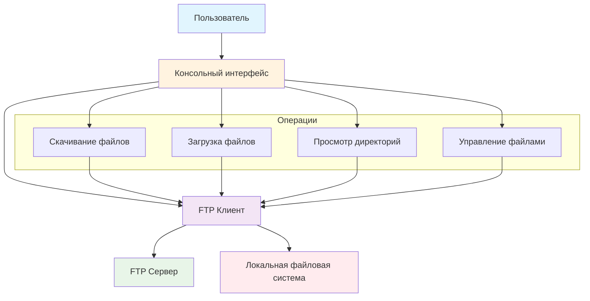

```mermaid
graph TD
    A[Пользователь] --> B[Консольный интерфейс]
    B --> C[FTP Клиент]
    C --> D[FTP Сервер]
    C --> E[Локальная файловая система]
    
    subgraph "Операции"
        F[Скачивание файлов]
        G[Загрузка файлов]
        H[Просмотр директорий]
        I[Управление файлами]
    end
    
    B --> F
    B --> G
    B --> H
    B --> I
    
    F --> C
    G --> C
    H --> C
    I --> C
    
    style A fill:#e1f5fe
    style B fill:#fff3e0
    style C fill:#f3e5f5
    style D fill:#e8f5e8
    style E fill:#ffebee
```
